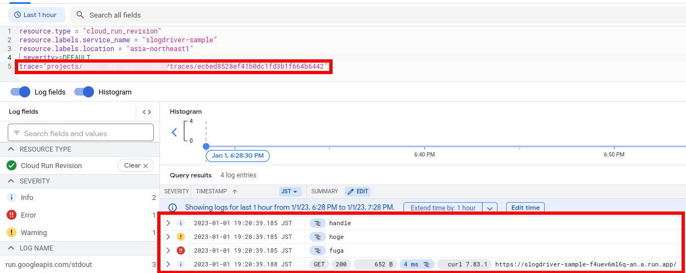

# Cloud Run example

## Usage

Set your own GCP project ID.

```bash
gcloud config set project YOUR_PROJECT_ID
```

Deploy to [Cloud Run](https://console.cloud.google.com/run)

```bash
gcloud run deploy slogdriver-sample --set-env-vars GOOGLE_CLOUD_PROJECT=YOUR_PROJECT_ID
```

You can see the endpoint the above command log.

```bash
curl https://YOUR_CLOUD_RUN_ENDPOINT/
```

You can see your [Cloud Run](https://console.cloud.google.com/run) and see log.

This sample uses Cloud trace, and you can see all logs for one request with the same trace_id, as show below.



## Clean up

```bash
gcloud run services delete slogdriver-sample
```
